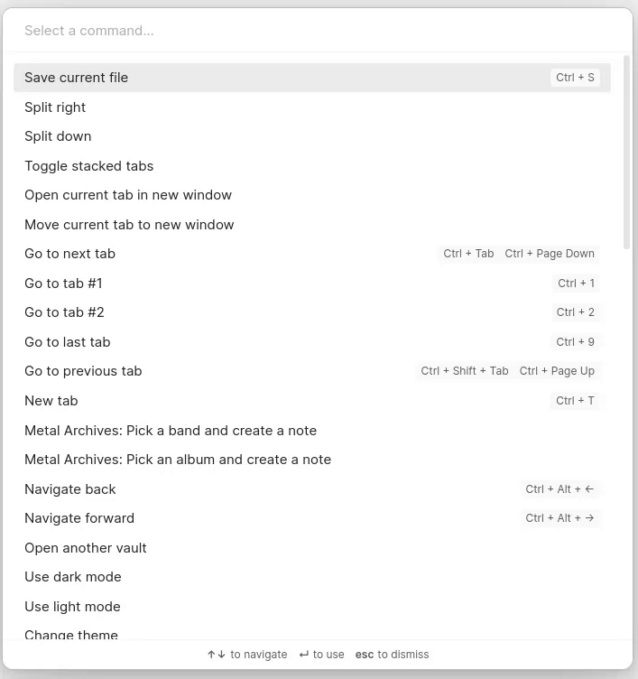
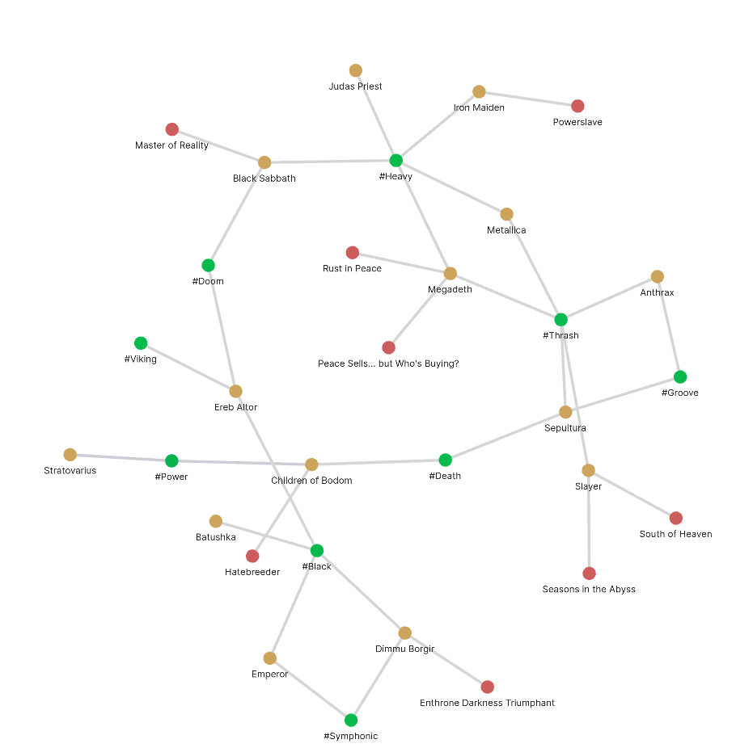

# Obsidian Metal Archives Plugin

This is a plugin for Obsidian that allows you to create notes about Metal bands and albums, by fetching data from Metal Archives (https://www.metal-archives.com/).

The plugin provides two commands:
- Search for a band and create a note
- Search for an album and create a note

## Usage example

### Result graph with bands, albums and tags
 

